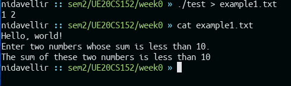
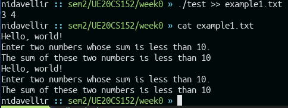
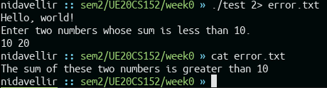
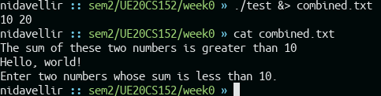
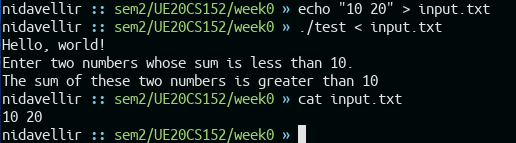
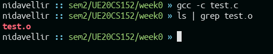
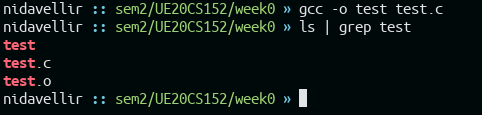

# UE20CS152 Week 1
#### Anirudh Rowjee `PES2UG20CS050`

The Program that will be used for this assignment (takes an input, validates it, gives error and/or output) is as follows
```c
#include <stdio.h>

int main()
{
    int a, b, c;

    printf("Hello, world!\n");
    printf("Enter two numbers whose sum is less than 10.\n");

    scanf("%d %d", &a, &b);
    c = a + b;

    if (c >= 10)
    {
        fprintf(stderr, "The sum of these two numbers is greater than 10\n");
        return 1;
    }
    else
    {
        printf("The sum of these two numbers is less than 10\n");
        return 0;
    }
    return 0;
}
```

```
# use this command to build and run the program
$ gcc -o test test.c && ./test
```


## Task 1
Redirect Standard Output: Write to New File



## Task 2
Redirect Standard Output: Writes to the Same File



## Task 3
Redirect Standard Error To a File




## Task 4
Redirect All Output: Writes to Same File




## Task 5
Input Redirection-Taking input from file



## Task 6
Options in gcc compiler

### `gcc --help`
```
nidavellir :: sem2/UE20CS152/week0 » gcc --help
Usage: gcc [options] file...
Options:
  -pass-exit-codes         Exit with highest error code from a phase.
  --help                   Display this information.
  --target-help            Display target specific command line options.
  --help={common|optimizers|params|target|warnings|[^]{joined|separate|undocumented}}[,...].
                           Display specific types of command line options.
  (Use '-v --help' to display command line options of sub-processes).
  --version                Display compiler version information.
  -dumpspecs               Display all of the built in spec strings.
  -dumpversion             Display the version of the compiler.
  -dumpmachine             Display the compiler's target processor.
  -print-search-dirs       Display the directories in the compiler's search path.
...
```

### `gcc -E test.c`

```
# 1 "test.c"
# 1 "<built-in>"
# 1 "<command-line>"
# 31 "<command-line>"
# 1 "/usr/include/stdc-predef.h" 1 3 4
# 32 "<command-line>" 2
# 1 "test.c"
# 1 "/usr/include/stdio.h" 1 3 4
# 27 "/usr/include/stdio.h" 3 4
# 1 "/usr/include/x86_64-linux-gnu/bits/libc-header-start.h" 1 3 4
# 33 "/usr/include/x86_64-linux-gnu/bits/libc-header-start.h" 3 4
# 1 "/usr/include/features.h" 1 3 4
# 461 "/usr/include/features.h" 3 4
# 1 "/usr/include/x86_64-linux-gnu/sys/cdefs.h" 1 3 4
# 452 "/usr/include/x86_64-linux-gnu/sys/cdefs.h" 3 4
# 1 "/usr/include/x86_64-linux-gnu/bits/wordsize.h" 1 3 4
# 453 "/usr/include/x86_64-linux-gnu/sys/cdefs.h" 2 3 4
# 1 "/usr/include/x86_64-linux-gnu/bits/long-double.h" 1 3 4
# 454 "/usr/include/x86_64-linux-gnu/sys/cdefs.h" 2 3 4
# 462 "/usr/include/features.h" 2 3 4
# 485 "/usr/include/features.h" 3 4
# 1 "/usr/include/x86_64-linux-gnu/gnu/stubs.h" 1 3 4
# 10 "/usr/include/x86_64-linux-gnu/gnu/stubs.h" 3 4
# 1 "/usr/include/x86_64-linux-gnu/gnu/stubs-64.h" 1 3 4
# 11 "/usr/include/x86_64-linux-gnu/gnu/stubs.h" 2 3 4
# 486 "/usr/include/features.h" 2 3 4
# 34 "/usr/include/x86_64-linux-gnu/bits/libc-header-start.h" 2 3 4
# 28 "/usr/include/stdio.h" 2 3 4

...

# 1 "/usr/lib/gcc/x86_64-linux-gnu/9/include/stddef.h" 1 3 4
# 209 "/usr/lib/gcc/x86_64-linux-gnu/9/include/stddef.h" 3 4

# 209 "/usr/lib/gcc/x86_64-linux-gnu/9/include/stddef.h" 3 4
typedef long unsigned int size_t;
# 34 "/usr/include/stdio.h" 2 3 4


# 1 "/usr/lib/gcc/x86_64-linux-gnu/9/include/stdarg.h" 1 3 4
# 40 "/usr/lib/gcc/x86_64-linux-gnu/9/include/stdarg.h" 3 4
typedef __builtin_va_list __gnuc_va_list;


extern void funlockfile (FILE *__stream) __attribute__ ((__nothrow__ , __leaf__));
# 858 "/usr/include/stdio.h" 3 4
extern int __uflow (FILE *);
extern int __overflow (FILE *, int);
# 873 "/usr/include/stdio.h" 3 4

# 2 "test.c" 2


# 3 "test.c"
int main()
{
    int a, b, c;

    printf("Hello, world!\n");
    printf("Enter two numbers whose sum is less than 10.\n");

    scanf("%d %d", &a, &b);
    c = a + b;

    if (c >= 10)
    {
        fprintf(
# 15 "test.c" 3 4
               stderr
# 15 "test.c"
                     , "The sum of these two numbers is greater than 10\n");
        return 1;
    }
    else
    {
        printf("The sum of these two numbers is less than 10\n");
        return 0;
    }
    return 0;
}
```

### `gcc -c test.c`


### `gcc -o test test.c`


